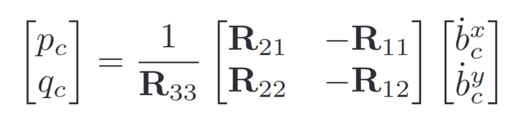

# Project: Building a Controller

## Writeup

Here I am going to describe the rubric points of the project and how I addressed each one.

The complete 3D control architecture can be divided as follows:

* Body rate control
* Roll-Pitch control
* Altitude control
* Lateral position (x, y) control
* Yaw control

## Controller Implementation

### Body rate control

The body rate controller receives the desired and actual body rates and it calculates the desired moments for each axis.

It is a proportional controller (with proportional gain `kpPQR`) and considers the moments of inertia over each axis to calculate the commanded moments:

```c++
momentCmd = I * kpPQR * rate_error;
```

The controller is implemented inside `BodyRateControl()` from `QuadControl.cpp`.

### Roll Pitch control

The roll-pitch controller calculates the desired pitch and roll angle rates (`p_c` & `q_c`) given the desired lateral acceleration, commanded thrust and current attitude of the vehicle.

For converting local accelerations into body rates we need to use the rotation matrix `R`.

First, I calculate the desired rate of change of the matrix elements `R13` & `R23` using a P controller:

```c++
// Desired rate of change of matrix elements
float b_x_c_dot = kpBank * (b_x_c - b_x_a);
float b_y_c_dot = kpBank * (b_y_c - b_y_a);
```

Then, using the following transformation we can finally compute the desired angle rates:



```c++
// Desired pitch & roll rates
float p_c = (R21*b_x_c_dot - R11*b_y_c_dot) / R33;
float q_c = (R22*b_x_c_dot - R12*b_y_c_dot) / R33;
```

This controller is implemented in the `RollPitchControl()` function.

### Altitude controller

Here we need to compute the desired thrust of the vehicle using a second order system.

I have used a cascaded proportional controller to first determine the velocity and be able to constrain it:

```c++
// Commanded vertical velocity
float z_err = posZCmd - posZ;
float z_dot_c = kpPosZ * z_err + velZCmd;

// Constrain vertical velocity
z_dot_c = CONSTRAIN(z_dot_c, -maxAscentRate, maxDescentRate);
```

Then, I compute the desired vertical acceleration and I add an integrator term to account for non-idealities:

```c++
// Accumulate integral error
integratedAltitudeError += z_err * dt;

// Commanded vertical acceleration
float u_1 = kpVelZ * (z_dot_c - velZ) + KiPosZ * integratedAltitudeError + accelZCmd;
```

Finally, I transform the desired acceleration into commanded thrust (N) using the `mass`of the vehicle and constrain the result between the minimum and maximum motor thrust:

```c++
// Calculate thrust (N)
thrust = mass * (9.81f - u_1) / R(2,2);

// Constrain thrust
thrust = CONSTRAIN(thrust, 4*minMotorThrust, 4*maxMotorThrust);
```

The altitude controller is implemented inside `AltitudeControl()`.

### Lateral position control

In this part, we need to use the local position and velocity in x and y to calculate a desired lateral acceleration.

Here I use another cascaded P controller to calculate the velocity (and constrain it):

```c++
// Desired velocity
V3F vel_c = kpPosXY * (posCmd - pos) + velCmd;

// Constrain velocity
vel_c.x = CONSTRAIN(vel_c.x, -maxSpeedXY, maxSpeedXY);
vel_c.y = CONSTRAIN(vel_c.y, -maxSpeedXY, maxSpeedXY);
```

And calculate the commanded acceleration:

```c++
// Desired acceleration
accelCmd += kpVelXY * (vel_c - vel);

// Constrain acceleration
accelCmd.x = CONSTRAIN(accelCmd.x, -maxAccelXY, maxAccelXY);
accelCmd.y = CONSTRAIN(accelCmd.y, -maxAccelXY, maxAccelXY);
```

This part of the code is located in `LateralPositionControl()`.

### Yaw control

The yaw controller calculates the desired yaw rate using a simple P controller:

```c++
// Desired yaw rate
yawRateCmd = kpYaw * yaw_error;
```

It is implemented inside `YawControl()`.

### Calculate motor commands

Finally, the output of the controller (collective thrust and desired moments) is transformed to calculate the desired thrust of each motor.

For that we need to calculate the forces (in Newtons) around each axis:

```c++
// Forces around x, y, z axis (N)
float p_bar = momentCmd.x / l;
float q_bar = momentCmd.y / l;
float r_bar = -momentCmd.z / kappa;
```

And then, we are able to calculate the individual forces for each motor:

```c++
// Individual forces
float F1 = (c_bar + p_bar + q_bar + r_bar) / 4.f;
float F2 = (c_bar - p_bar + q_bar - r_bar) / 4.f;
float F3 = (c_bar + p_bar - q_bar - r_bar) / 4.f;
float F4 = (c_bar - p_bar - q_bar + r_bar) / 4.f;
```

The motor commands are caluclated inside `GenerateMotorCommands()`.

## Fight evaluation

The drone is able to pass each one of the scenarios in the simulator.
